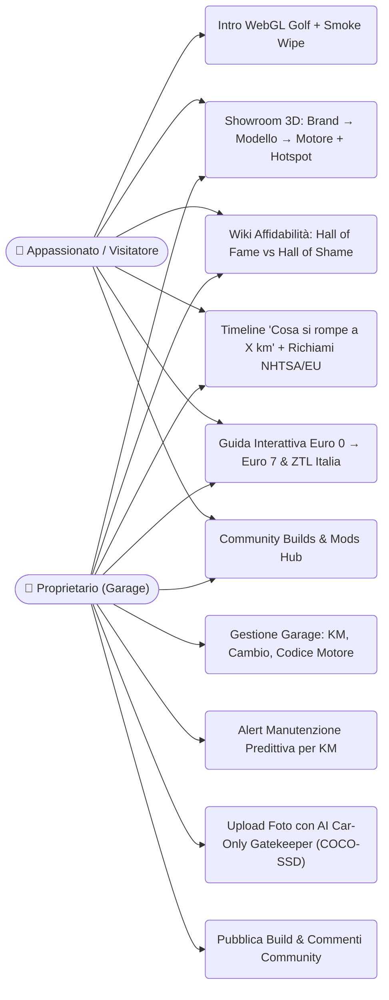
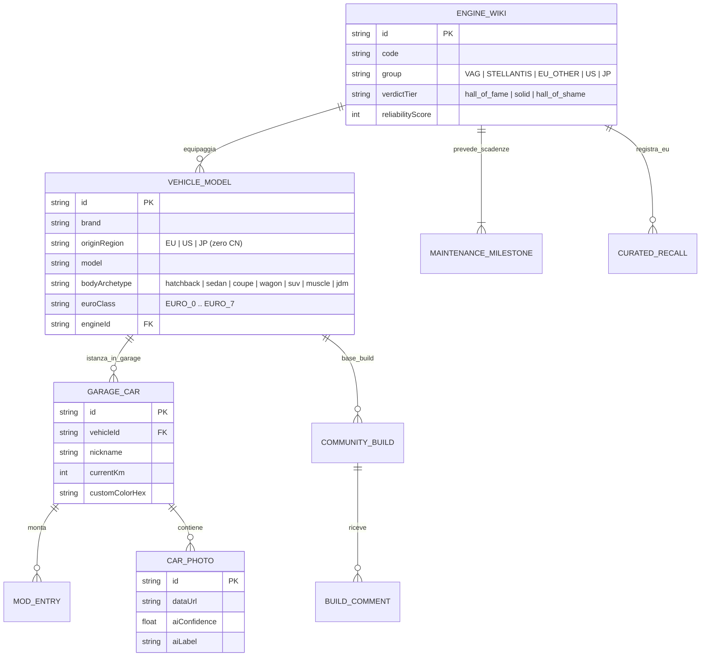

# Progettazione UML & ER — CarFix

## 1. Diagramma dei Casi d'Uso

```mermaid
flowchart LR
    V(["👤 Appassionato / Visitatore"]) --> UC1("Intro WebGL Golf + Smoke Wipe")
    V --> UC2("Showroom 3D: Brand → Modello → Motore + Hotspot")
    V --> UC3("Wiki Affidabilità: Hall of Fame vs Hall of Shame")
    V --> UC4("Timeline 'Cosa si rompe a X km' + Richiami NHTSA/EU")
    V --> UC5("Guida Interattiva Euro 0 → Euro 7 & ZTL Italia")
    V --> UC6("Community Builds & Mods Hub")
    U(["🔧 Proprietario (Garage)"]) --> UC2 & UC3 & UC4 & UC5 & UC6
    U --> UC7("Gestione Garage: KM, Cambio, Codice Motore")
    U --> UC8("Alert Manutenzione Predittiva per KM")
    U --> UC9("Upload Foto con AI Car-Only Gatekeeper (COCO-SSD)")
    U --> UC10("Pubblica Build & Commenti Community")
```

## 2. Diagramma Entità-Relazione (Modello Dati Local-First)

```mermaid
erDiagram
    ENGINE_WIKI ||--o{ VEHICLE_MODEL : "equipaggia"
    ENGINE_WIKI ||--|{ MAINTENANCE_MILESTONE : "prevede_scadenze"
    ENGINE_WIKI ||--o{ CURATED_RECALL : "registra_eu"
    VEHICLE_MODEL ||--o{ GARAGE_CAR : "istanza_in_garage"
    VEHICLE_MODEL ||--o{ COMMUNITY_BUILD : "base_build"
    GARAGE_CAR ||--o{ MOD_ENTRY : "monta"
    GARAGE_CAR ||--o{ CAR_PHOTO : "contiene"
    COMMUNITY_BUILD ||--o{ BUILD_COMMENT : "riceve"

    ENGINE_WIKI {
        string id PK
        string code
        string group "VAG | STELLANTIS | EU_OTHER | US | JP"
        string verdictTier "hall_of_fame | solid | hall_of_shame"
        int reliabilityScore
    }

    VEHICLE_MODEL {
        string id PK
        string brand
        string originRegion "EU | US | JP (zero CN)"
        string model
        string bodyArchetype "hatchback | sedan | coupe | wagon | suv | muscle | jdm"
        string euroClass "EURO_0 .. EURO_7"
        string engineId FK
    }

    GARAGE_CAR {
        string id PK
        string vehicleId FK
        string nickname
        int currentKm
        string customColorHex
    }

    CAR_PHOTO {
        string id PK
        string dataUrl
        float aiConfidence
        string aiLabel
    }
```
